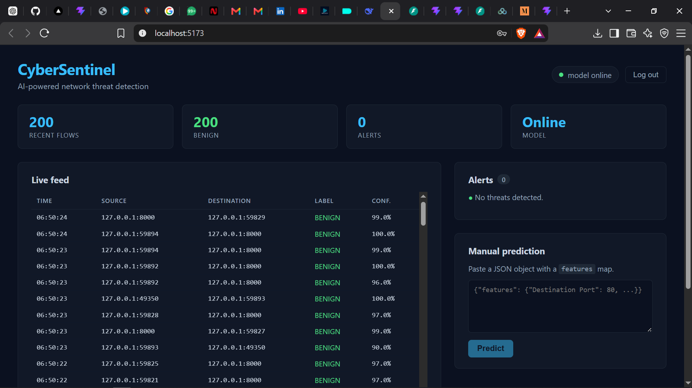

# CyberSentinel

**AI-powered network intrusion detection system.** Captures live network traffic, classifies each flow with a machine learning model, and streams real-time alerts to a web dashboard.



---

## What it does

CyberSentinel watches packets on your machine, groups them into network flows, extracts 40 statistical features from each flow, and runs a Random Forest classifier to identify whether it's benign or one of eight attack types:

`BENIGN` · `DoS` · `DDoS` · `PortScan` · `BruteForce` · `WebAttack` · `Bot` · `Infiltration` · `Heartbleed`

Every classified flow is streamed to a React dashboard in real time, with alerts highlighted for anything that isn't benign.

**This is a passive observation tool** — it identifies and reports, it never blocks, injects, or modifies traffic. It's designed for monitoring your own network in a lab environment.

---

## Results

Trained on the **CICIDS2017** dataset (~2.5M flows after cleaning) with a Random Forest classifier.

| Metric | Value |
|---|---|
| Accuracy | **99.85%** |
| **Macro F1** | **0.9317** |
| Weighted F1 | 99.85% |
| Classes | 9 |
| Features | 40 (selected from 78) |
| Training set | 2,016,638 flows |
| Test set | 504,160 flows |

**Per-class performance** (top-40 feature model):

| Class | Precision | Recall | F1 |
|---|---|---|---|
| BENIGN | 1.00 | 1.00 | 1.00 |
| DoS | 1.00 | 1.00 | 1.00 |
| DDoS | 1.00 | 1.00 | 1.00 |
| PortScan | 0.99 | 0.99 | 0.99 |
| BruteForce | 1.00 | 1.00 | 1.00 |
| WebAttack | 0.98 | 0.98 | 0.98 |
| Bot | 0.87 | 0.78 | 0.82 |
| Infiltration | 1.00 | 0.43 | 0.60 |
| Heartbleed | 1.00 | 1.00 | 1.00 |

> **Note on macro F1:** accuracy is misleading for this dataset because 83% of flows are benign. Macro F1 averages performance across all classes equally, so it exposes weak spots the accuracy number hides. Bot, Infiltration, and Heartbleed have very few training samples — their metrics are reported honestly, not cherry-picked.

---

## Architecture

```mermaid
flowchart LR
    NIC[Network Interface] --> SCAPY[Scapy capture]
    SCAPY --> FLOW[Flow tracker<br/>40 features]
    FLOW --> API[FastAPI /predict]
    API --> MODEL[(Random Forest<br/>.joblib)]
    API --> STORE[(In-memory<br/>flow buffer)]
    STORE --> DASH[React Dashboard<br/>live feed + alerts]
    DB[(PostgreSQL<br/>users)] --- API
